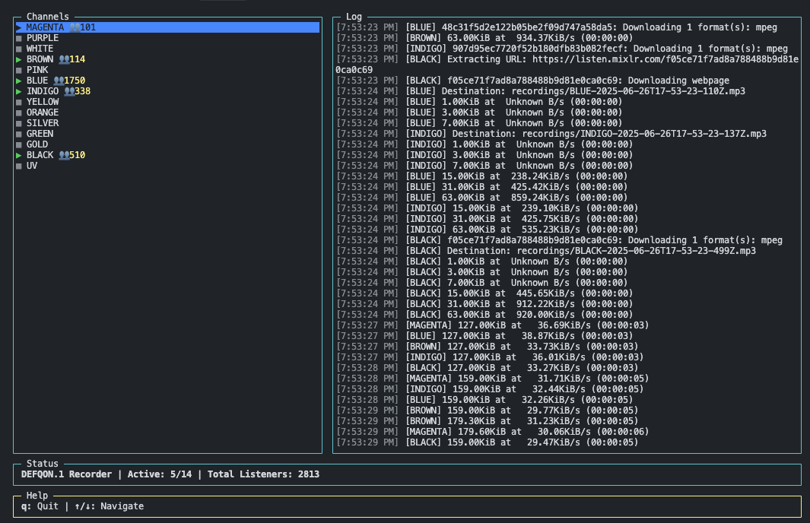

# DEFQON.1 Stream Recorder

A powerful terminal-based application for recording multiple Mixlr streams simultaneously with a beautiful TUI (Terminal User Interface). Perfect for recording live DJ sets from DEFQON.1 and other Mixlr streams.



## ✨ Features

- 🎵 Record multiple Mixlr streams simultaneously
- 🖥️ Intuitive Terminal User Interface (TUI)
- 📊 Real-time listener count display
- ⏱️ Recording duration tracking
- 🚀 Automatic stream detection and recording
- 🔄 Live reload of stream configurations
- 🎚️ Separate volume control for each stream
- 🎨 Color-coded status indicators

## 🚀 Getting Started

### Prerequisites

- [Bun](https://bun.sh/) (v1.0.0 or higher)
- [yt-dlp](https://github.com/yt-dlp/yt-dlp) (for stream downloading)

### Installation

1. Clone the repository:
   ```bash
   git clone https://github.com/yourusername/defqon1-mixlr-recorder.git
   cd defqon1-mixlr-recorder
   ```

2. Install dependencies:
   ```bash
   bun install
   ```

3. Configure your streams in `streams.json` (see Configuration section below)

4. Start the application:
   ```bash
   bun start
   ```

## 🛠️ Configuration

### `config.json`

Customize the application behavior in `config.json`:

```json
{
  "outputDir": "./recordings",
  "pollingInterval": 10000,
  "logLevel": "info"
}
```

## 🎛️ Controls

- `↑/↓` - Navigate between streams
- `Space` - Toggle recording for selected stream
- `q` - Quit application
- `r` - Refresh stream list

## 📂 File Naming

Recordings are saved in the following format:
```
[ChannelName]_[YYYY-MM-DD]_[HH-MM-SS].mp3
```

## 📝 License

This project is licensed under the MIT License - see the [LICENSE](LICENSE) file for details.

## 🙏 Acknowledgments

- Made with ❤️ for the DEFQON.1 community
- Powered by [Mixlr](https://mixlr.com/)
- Built with [Bun](https://bun.sh/) and [blessed](https://github.com/chjj/blessed)

---

*This project is not affiliated with or endorsed by Q-dance or Mixlr. Use at your own risk and respect all copyright laws and terms of service.*
